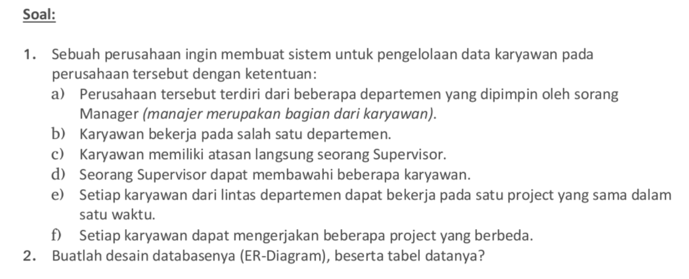
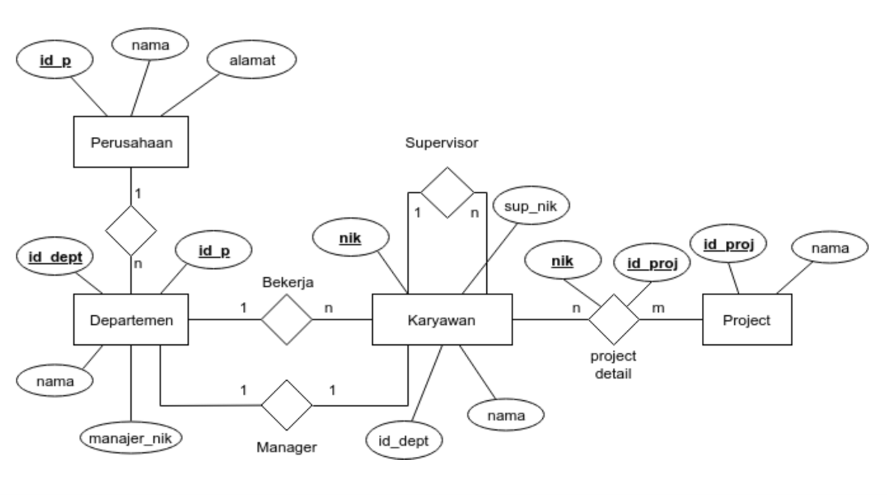
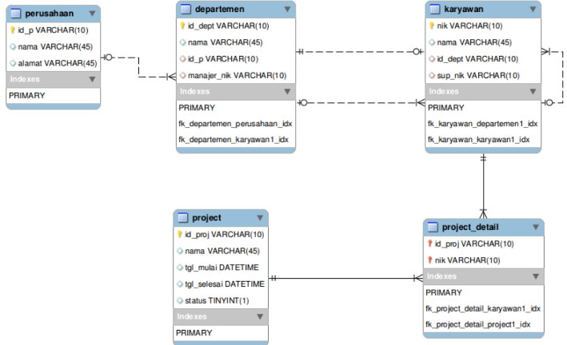
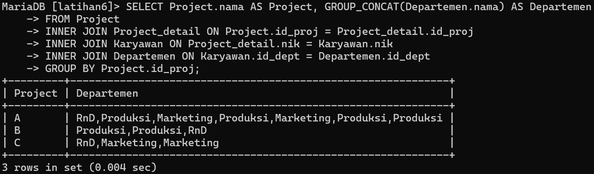
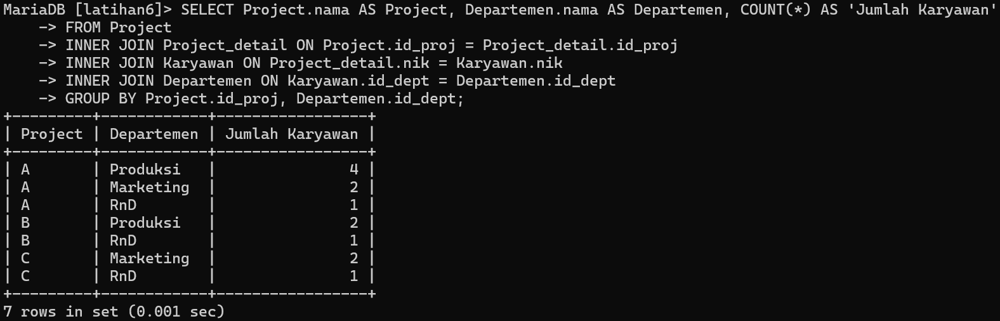
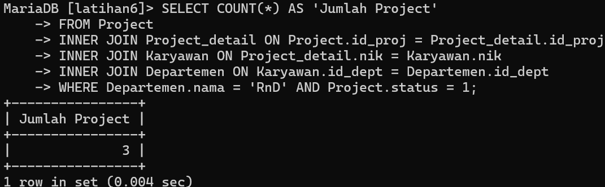
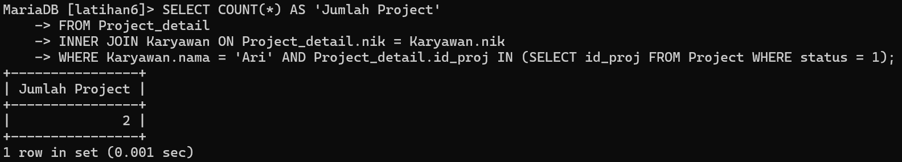
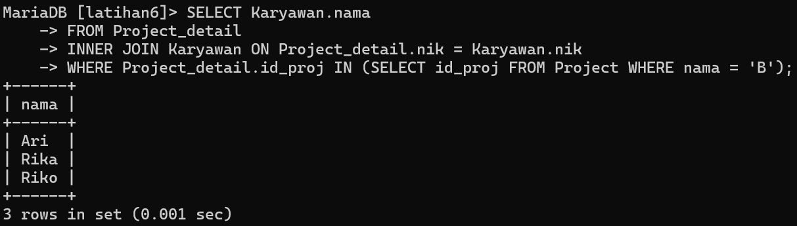

# Tugas Praktikum { Pertemuan ke 14 } 


## Profil
| Variable | Isi |
| -------- | --- |
| **Nama** | Muhammad Nurul Firdaus |
| **NIM** | 312310495 |
| **Kelas** | TI.23.A5 |
| **Mata Kuliah** | Basis data |

# Soal


# ER-Diagram


# Tabel Data


# Soal Latihan Praktikum
- Buat query untuk menampilkan:
1. Departemen apa saja yang terlibat dalam tiap-tiap project
2. Jumlah karyawan tiap departemen yang bekerja pada tiap-tiap
project
3. Ada berapa project yang sedang dikerjakan oleh departemen RnD?
(ket: project berjalan adalah yang statusnya 1)
4. Berapa banyak project yang sedang dikerjakan oleh Ari?
5. Siapa saja yang mengerjakan projcet B?


# Soal Latihan Praktikum

## 1. Departemen Apa Saja Yang Terlibat Dalam Tiap-tiap Project.

```
SELECT Project.nama AS Project, GROUP_CONCAT(Departemen.nama) AS Departemen
FROM Project
INNER JOIN Project_detail ON Project.id_proj = Project_detail.id_proj
INNER JOIN Karyawan ON Project_detail.nik = Karyawan.nik
INNER JOIN Departemen ON Karyawan.id_dept = Departemen.id_dept
GROUP BY Project.id_proj;
```
***Output :***




## 2. Jumlah Karyawan Tiap Departemen Yang Bekerja Pada Tiap-tiap Project.

```
SELECT Project.nama AS Project, Departemen.nama AS Departemen, COUNT(*) AS 'Jumlah Karyawan'
FROM Project
INNER JOIN Project_detail ON Project.id_proj = Project_detail.id_proj
INNER JOIN Karyawan ON Project_detail.nik = Karyawan.nik
INNER JOIN Departemen ON Karyawan.id_dept = Departemen.id_dept
GROUP BY Project.id_proj, Departemen.id_dept;
```
***Output :***




## 3. Ada Berapa Project Yang Sedang Dikerjakan Oleh Departemen ***RnD***? (ket: project berjalan adalah yang statusnya 1).

```
SELECT COUNT(*) AS 'Jumlah Project'
FROM Project
INNER JOIN Project_detail ON Project.id_proj = Project_detail.id_proj
INNER JOIN Karyawan ON Project_detail.nik = Karyawan.nik
INNER JOIN Departemen ON Karyawan.id_dept = Departemen.id_dept
WHERE Departemen.nama = 'RnD' AND Project.status = 1;
```
***Output :***




## 4. Berapa banyak Project yang sedang dikerjakan oleh Ari ?

```
SELECT COUNT(*) AS 'Jumlah Project'
FROM Project_detail
INNER JOIN Karyawan ON Project_detail.nik = Karyawan.nik
WHERE Karyawan.nama = 'Ari' AND Project_detail.id_proj IN (SELECT id_proj FROM Project WHERE status = 1);
```
***Output :***




## 5. Siapa Saja Yang Mengerjakan Project B ?

```
SELECT Karyawan.nama
FROM Project_detail
INNER JOIN Karyawan ON Project_detail.nik = Karyawan.nik
WHERE Project_detail.id_proj IN (SELECT id_proj FROM Project WHERE nama = 'B');
```
***Output :***

